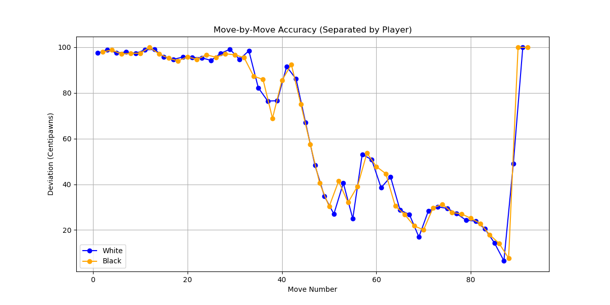

# Chess Moves Analysis

This project provides a Python-based solution to analyze the accuracy of moves in a chess game by comparing each move to the best move suggested by the Stockfish engine. The accuracy is evaluated as a percentage, where 100% represents perfect play.

## Features
- Calculates move-by-move accuracy percentages.
- Plots move accuracy for each player (White and Black) separately.
- Highlights areas of deviation from optimal play.

## Requirements
Ensure you have the following installed:
- Python 3.7+
- Stockfish (a powerful open-source chess engine)
- Required Python libraries:
  - `python-chess`
  - `matplotlib`

You can install the necessary Python libraries using:
```bash
pip install python-chess matplotlib
```

## Setup
1. **Download Stockfish**: 
   - Download the appropriate version for your system from [Stockfish's official website](https://stockfishchess.org/download/).
   - Place the executable in the working directory or note its path.

2. **Add PGN Game Data**:
   - Input the moves of the chess game in PGN format.

3. **Update Path to Stockfish**:
   - Update the variable `stockfish_path` in the script with the path to your Stockfish executable.

## How to Use
### Example Notebook
1. Define the game PGN and provide the Stockfish path:
   ```python
   pgn_moves = """1. d4 d5 2. h3 Nc6 3. Nf3 Bf5 4. a3 h6 5. e3 a6 ..."""
   stockfish_path = "path/to/stockfish"
   ```

2. Calculate accuracy:
   ```python
   average_accuracy, accuracy_percentages = calculate_accuracy(pgn_moves, stockfish_path)
   print(f"Average Accuracy: {average_accuracy:.2f}%")
   ```

3. Plot accuracy by player:
   ```python
   plot_accuracy_by_player(accuracy_percentages)
   ```

### Functions
#### `calculate_accuracy(pgn_moves, stockfish_path, max_deviation=2000)`
- **Description**: Calculates the accuracy percentages for each move.
- **Parameters**:
  - `pgn_moves`: PGN string of the chess game.
  - `stockfish_path`: Path to the Stockfish executable.
  - `max_deviation`: Maximum centipawn deviation for scaling accuracy percentages (default is 2000).
- **Returns**:
  - `average_accuracy`: Overall average accuracy of the game.
  - `accuracy_percentages`: List of accuracy percentages for each move.

#### `plot_accuracy_by_player(accuracy)`
- **Description**: Plots move-by-move accuracy for White and Black separately.
- **Parameters**:
  - `accuracy`: List of move-by-move accuracy percentages.

## Visualization
The `plot_accuracy_by_player` function generates a graph separating White's and Black's move accuracies for better clarity.



## Example Output
```bash
Average Accuracy (Higher is better): 62.95%
Move-by-Move Accuracy: [97.15, 97.10, 98.70, 99.50, ...]
```

## License
This project is open-source and available under the MIT License.

## Acknowledgments
- Powered by [Stockfish](https://stockfishchess.org/)
- Built using the `python-chess` library.
